# Hotel Management System - Use Case Diagram (Mermaid)

```mermaid
graph TB
    subgraph Actors
        Guest[Guest<br/>iOS App]
        Admin[Admin]
        Manager[Manager]
        Receptionist[Receptionist]
        Chef[Chef]
        Cleaner[Cleaner]
    end

    subgraph "Hotel Management System"
        subgraph "Guest Features"
            UC1[Register Account]
            UC2[Login]
            UC3[View Available Rooms]
            UC4[Make Reservation]
            UC5[View My Reservations]
            UC6[Cancel Reservation]
            UC7[Request Room Service]
            UC8[Request Housekeeping]
            UC9[Leave Review]
            UC10[View Staff Response]
            UC11[Update Profile]
            UC12[Manage Settings]
        end

        subgraph "Admin Features"
            UC13[Manage Employees]
            UC14[View Reports]
            UC15[Delete Guests]
        end

        subgraph "Manager Features"
            UC16[View Dashboard]
            UC17[Manage Rooms]
            UC18[View All Reservations]
            UC19[Respond to Reviews]
            UC20[View Guests]
        end

        subgraph "Receptionist Features"
            UC21[View Room Status]
            UC22[Update Room Status]
        end

        subgraph "Chef Features"
            UC23[View Service Dashboard]
            UC24[Manage Room Service]
        end

        subgraph "Cleaner Features"
            UC25[View Cleaning Dashboard]
            UC26[Manage Housekeeping]
        end

        subgraph "System Features"
            UC27[Send Email Notification]
            UC28[Send WebSocket Notification]
            UC29[Generate Reservation Code]
        end
    end

    %% Guest relationships
    Guest --> UC1
    Guest --> UC2
    Guest --> UC3
    Guest --> UC4
    Guest --> UC5
    Guest --> UC6
    Guest --> UC7
    Guest --> UC8
    Guest --> UC9
    Guest --> UC10
    Guest --> UC11
    Guest --> UC12

    %% Admin relationships
    Admin --> UC13
    Admin --> UC14
    Admin --> UC15
    Admin --> UC16
    Admin --> UC17
    Admin --> UC18
    Admin --> UC19
    Admin --> UC20
    Admin --> UC24
    Admin --> UC26

    %% Manager relationships
    Manager --> UC16
    Manager --> UC17
    Manager --> UC18
    Manager --> UC19
    Manager --> UC20
    Manager --> UC24
    Manager --> UC26

    %% Receptionist relationships
    Receptionist --> UC16
    Receptionist --> UC20
    Receptionist --> UC21
    Receptionist --> UC22

    %% Chef relationships
    Chef --> UC16
    Chef --> UC23
    Chef --> UC24

    %% Cleaner relationships
    Cleaner --> UC16
    Cleaner --> UC25
    Cleaner --> UC26
    Cleaner --> UC22

    %% Include relationships
    UC4 -.->|include| UC29
    UC4 -.->|include| UC27
    UC6 -.->|include| UC27
    UC6 -.->|include| UC28
    UC7 -.->|include| UC27
    UC7 -.->|include| UC28
    UC8 -.->|include| UC28
    UC9 -.->|include| UC28
    UC19 -.->|include| UC27
    UC24 -.->|include| UC27
    UC26 -.->|include| UC27

    %% Extend relationships
    UC10 -.->|extend| UC9

    style Guest fill:#e1f5ff
    style Admin fill:#ffe1e1
    style Manager fill:#fff3e1
    style Receptionist fill:#e8f5e9
    style Chef fill:#f3e5f5
    style Cleaner fill:#fff9c4
```



## Actori și Responsabilități

### 👤 Guest (iOS App)
Client al hotelului care folosește aplicația mobilă iOS pentru:
- Înregistrare și autentificare
- Vizualizare camere disponibile
- Creare și gestionare rezervări
- Solicitare room service și curățenie
- Lasă recenzii și vede răspunsurile staff-ului
- Gestionare profil și setări

### 👨‍💼 Admin
Administrator cu acces complet la sistem:
- Gestionare angajați (CRUD)
- Vizualizare rapoarte financiare
- Ștergere oaspeți
- Toate funcționalitățile Manager-ului

### 👔 Manager
Manager cu acces la majoritatea funcțiilor:
- Dashboard cu statistici detaliate
- Gestionare camere
- Vizualizare toate rezervările
- Răspuns la recenzii
- Gestionare cereri room service și curățenie

### 🏨 Receptionist
Recepționer cu acces limitat:
- Dashboard cu status camere
- Vizualizare oaspeți
- Actualizare status camere
- Vizualizare rezervări

### 👨‍🍳 Chef
Chef cu focus pe room service:
- Dashboard specific cu statistici comenzi
- Gestionare cereri room service
- Actualizare status comenzi

### 🧹 Cleaner
Personal curățenie:
- Dashboard cu progres curățenie
- Gestionare cereri de curățenie
- Actualizare status camere

## Relații între Use Cases

### Include (<<include>>)
Relații obligatorii între cazurile de utilizare:
- **Make Reservation** include:
  - Generate Reservation Code
  - Send Email Notification
- **Cancel Reservation** include:
  - Send Email Notification
  - Send WebSocket Notification
- **Request Room Service** include:
  - Send Email Notification
  - Send WebSocket Notification

### Extend (<<extend>>)
Funcționalități opționale:
- **View Staff Response** extinde **Leave Review** (disponibil doar dacă staff-ul a răspuns)

## Notificări Sistem

### 📧 Email Notifications
Trimise pentru:
- ✅ Confirmare rezervare
- ❌ Anulare rezervare
- 🍽️ Status room service (primită, în preparare, livrată)
- 🧹 Status curățenie (primită, în progres, finalizată)
- ⭐ Răspuns staff la recenzie

### 🔔 WebSocket Notifications (Real-time)
Afișate în aplicația de management pentru:
- 🎉 Înregistrare oaspete nou
- 🚫 Rezervare anulată
- ⭐ Recenzie nouă
- 🍽️ Cerere room service
- 🧹 Cerere curățenie

## Moștenire între Roluri

```
Admin ──inherits──> Manager ──inherits──> Receptionist
```

- **Admin** are toate permisiunile **Manager**-ului + funcții exclusive
- **Manager** are toate permisiunile **Receptionist**-ului + funcții suplimentare
- Fiecare rol inferior moștenește funcționalitățile rolului superior
